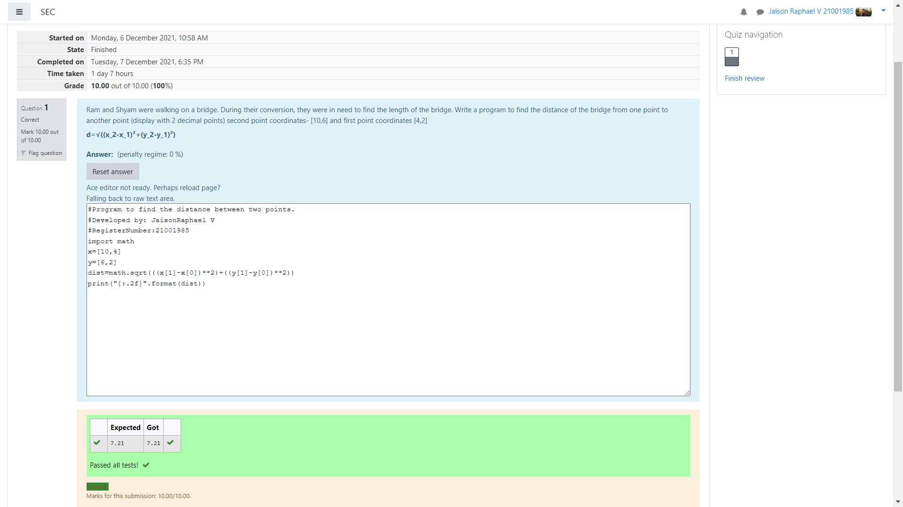

# DISTANCE-BETWEEN-TWO-POINTS

## AIM:
To write a python program to find the distance two 2 points
## ALGORITHM:
### Step 1: 
start the program
### Step 2:
import math
### Step 3: 
Substitute the values in the distance formula
### Step 4:
print the program 
### Step 5: 
end the program
### PROGRAM:
~~~
import math
x=[10,4]
y=[6,2]
dist=math.sqrt(((x[1]-x[0])**2)+((y[1]-y[0])**2))
print("{:.2f}".format(dist))
~~~

### OUTPUT:

### RESULT:
thus the distance betweem two points are found using python program
